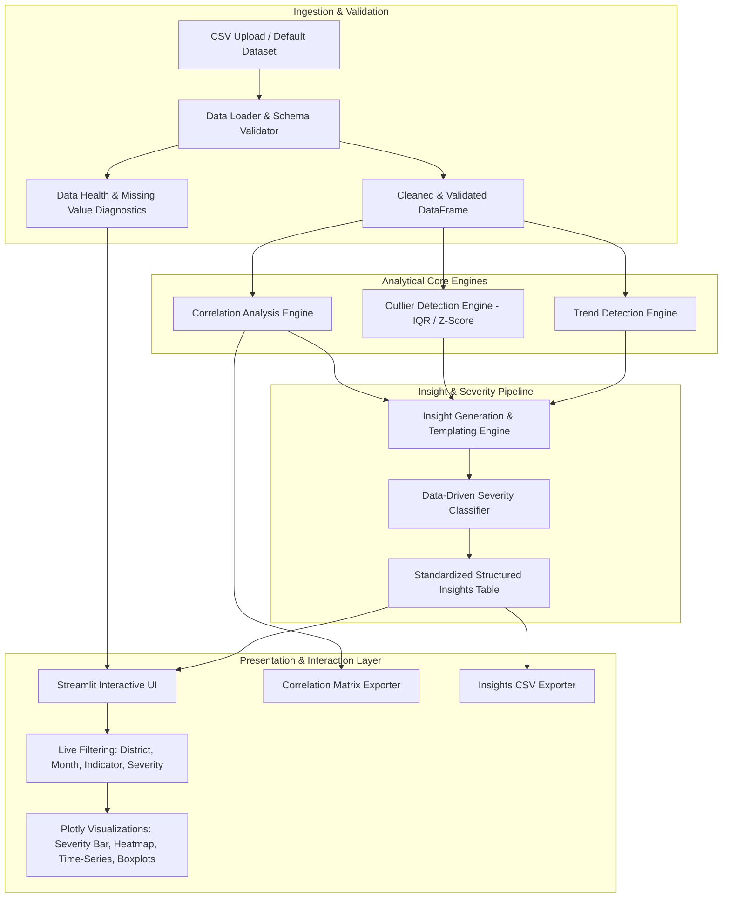

# Project Planning & System Architecture
## Automated Insight Generation — AI/ML

**Document Version:** 1.0.0  
**Status:** Approved Architecture & Implementation Plan  
**Target Environment:** Python 3.10+ | Streamlit | Pandas | NumPy | Plotly | Pytest  

---

## 1. End-to-End System Architecture & Data Flow

The application follows a **Modular Layered Architecture** with unidirectional data flow, designed for execution within a single Streamlit process.



### Data Flow Lifecycle:
1. **Source Ingestion:** User uploads a CSV or loads the default healthcare dataset (`sample_healthcare_data.csv`).
2. **Validation & Cleaning:** Schema validation checks required columns, standardizes datatypes, strips whitespace, and extracts missing-value metrics.
3. **Parallel Statistical Dispatch:** The cleaned DataFrame is fed into independent, stateless analytical engines:
   - **Trend Engine:** Computes consecutive Month-over-Month (MoM) percentage shifts per district-indicator series.
   - **Outlier Engine:** Detects anomalies across district distributions using either Tukey's IQR rule or Gaussian Z-scores.
   - **Correlation Engine:** Computes the full Pearson correlation matrix across numerical metrics.
4. **Insight Synthesis & Severity Rating:** Raw anomaly records are enriched with dynamic natural language descriptions and mapped to severity levels (`Low`, `Medium`, `High`) using parametric thresholds.
5. **Interactive UI Rendering:** Reactive Streamlit layout updates metrics, tables, Plotly charts, and CSV download links instantly upon any slider adjustment or filter change.

---

## 2. Directory Structure & File Responsibilities

```
insight-analytics/
├── data/
│   └── sample_healthcare_data.csv       # Default 6-district x 2-month sample dataset
├── src/
│   ├── __init__.py                      # Package initialization
│   ├── data_loader.py                   # CSV loading, schema validation, data profiling
│   ├── trend_engine.py                  # MoM percentage change and trend flagging
│   ├── outlier_engine.py                # IQR & Z-score outlier detection algorithms
│   ├── correlation_engine.py            # Pearson matrix computation & flagger
│   ├── severity_classifier.py           # Data-driven severity tier mapping
│   ├── insight_generator.py             # Structured insight builder & NL templating
│   └── visualizer.py                    # Plotly chart builders (Heatmap, Line, Bar, Box)
├── tests/
│   ├── __init__.py                      # Test suite initialization
│   ├── test_data_loader.py              # Schema & missing value unit tests
│   ├── test_trend_engine.py             # Trend calculation & threshold unit tests
│   ├── test_outlier_engine.py           # IQR and Z-score outlier unit tests
│   ├── test_correlation_engine.py       # Correlation matrix & flagging unit tests
│   ├── test_severity_classifier.py      # Severity threshold tier unit tests
│   └── test_insight_generator.py        # End-to-end insight schema verification
├── app.py                               # Streamlit application UI & reactive state
├── requirements.txt                     # Pinned project dependencies
├── pytest.ini                           # Pytest configuration
└── README.md                            # Comprehensive user & developer documentation
```

---

## 3. Module Responsibilities & Python File Purpose

| Module / File | Core Responsibility | Key Exports |
| :--- | :--- | :--- |
| `src/data_loader.py` | Validates CSV columns, checks data health, computes missing values, and sanitizes types. | `load_and_preprocess_csv()`, `validate_schema()`, `REQUIRED_COLUMNS` |
| `src/trend_engine.py` | Detects month-over-month shifts per district-indicator pair exceeding configurable $\theta_{\text{trend}}$. | `detect_trends()`, `compute_mom_change()` |
| `src/outlier_engine.py` | Detects statistical outliers per indicator via IQR or Z-score methods. | `detect_outliers()`, `compute_iqr_bounds()`, `compute_z_scores()` |
| `src/correlation_engine.py` | Calculates Pearson correlation matrix and flags pairs exceeding $\theta_{\text{corr}}$. | `compute_correlation_matrix()`, `flag_strong_correlations()` |
| `src/severity_classifier.py` | Assigns `Low`, `Medium`, or `High` severity using data-driven mathematical boundaries. | `classify_trend_severity()`, `classify_outlier_severity()`, `classify_correlation_severity()` |
| `src/insight_generator.py` | Synthesizes engine outputs into unified structured dictionaries with templated narratives. | `generate_all_insights()`, `format_insight_record()` |
| `src/visualizer.py` | Generates modern, interactive Plotly figures (dark/light harmonious themes). | `plot_severity_distribution()`, `plot_correlation_heatmap()`, `plot_district_time_series()`, `plot_indicator_distribution()` |
| `app.py` | Streamlit user interface, sidebar parameter sliders, live multi-select filters, and export triggers. | Streamlit entrypoint |

---

## 4. Complete Initial `requirements.txt`

```text
streamlit>=1.30.0
pandas>=2.0.0
numpy>=1.24.0
plotly>=5.18.0
scipy>=1.11.0
pytest>=7.4.0
```

---

## 5. Analytics Module Interfaces & Function Signatures

### 5.1 Data Loader (`src/data_loader.py`)
```python
def load_and_preprocess_csv(file_or_path: Union[str, io.BytesIO, io.StringIO]) -> Tuple[pd.DataFrame, Dict[str, Any]]:
    """
    Args:
        file_or_path: File path or uploaded file buffer.
    Returns:
        df: Cleaned and sorted DataFrame.
        diagnostics: Dictionary containing total_rows, unique_districts, unique_months, missing_counts, duplicate_records.
    Raises:
        ValueError: If mandatory columns are missing or file is unreadable.
    """
```

### 5.2 Trend Detection Engine (`src/trend_engine.py`)
```python
def detect_trends(
    df: pd.DataFrame, 
    threshold_pct: float = 10.0, 
    indicators: Optional[List[str]] = None
) -> List[Dict[str, Any]]:
    """
    Computes Month-over-Month (MoM) percentage change for each (district, indicator).
    Args:
        df: Cleaned dataframe sorted by month.
        threshold_pct: Minimum absolute % change required to flag (e.g. 10.0).
        indicators: List of numerical columns to evaluate.
    Returns:
        List of trend dictionaries containing:
        {
            'district': str, 'indicator': str, 'period': str, 
            'current_value': float, 'prev_value': float, 
            'change_pct': float, 'direction': 'increased'|'decreased', 
            'is_significant': bool
        }
    """
```

### 5.3 Outlier Detection Engine (`src/outlier_engine.py`)
```python
def detect_outliers(
    df: pd.DataFrame, 
    method: str = "iqr", 
    z_threshold: float = 3.0, 
    iqr_multiplier: float = 1.5,
    group_by_period: bool = True
) -> List[Dict[str, Any]]:
    """
    Identifies outliers across districts for each indicator.
    Args:
        df: Cleaned dataframe.
        method: 'iqr' or 'z_score'.
        z_threshold: Absolute Z-score cutoff (default: 3.0).
        iqr_multiplier: Tukey IQR multiplier (default: 1.5).
        group_by_period: If True, evaluates outliers per month; if False, across entire dataset.
    Returns:
        List of outlier dictionaries containing:
        {
            'district': str, 'indicator': str, 'period': str, 
            'value': float, 'method': str, 'score': float, # z-score or IQR distance
            'reference_mean': float, 'reference_std': float, # or Q1/Q3
            'bound_breached': 'upper'|'lower'
        }
    """
```

### 5.4 Correlation Detection Engine (`src/correlation_engine.py`)
```python
def compute_correlation_matrix(df: pd.DataFrame, indicators: Optional[List[str]] = None) -> pd.DataFrame:
    """Returns symmetric Pearson correlation matrix across numerical indicators."""

def flag_strong_correlations(
    corr_matrix: pd.DataFrame, 
    threshold: float = 0.70,
    sample_size: int = 0
) -> List[Dict[str, Any]]:
    """
    Extracts upper-triangle pairs where |r| >= threshold.
    Returns list of dicts with indicator_x, indicator_y, r_value, sample_size, is_small_sample.
    """
```

### 5.5 Severity Classification Engine (`src/severity_classifier.py`)
```python
def classify_trend_severity(abs_change_pct: float, base_threshold_pct: float) -> str:
    """Returns 'Low', 'Medium', or 'High' based on ratio of change to threshold."""

def classify_outlier_severity(z_score: float, base_z_threshold: float = 3.0) -> str:
    """Returns 'Low', 'Medium', or 'High' based on standard deviation distance."""

def classify_correlation_severity(abs_r: float, base_threshold: float = 0.70) -> str:
    """Returns 'Low', 'Medium', or 'High' based on correlation strength."""
```

### 5.6 Insight Generator (`src/insight_generator.py`)
```python
def generate_all_insights(
    df: pd.DataFrame,
    trend_threshold: float = 10.0,
    outlier_method: str = "z_score",
    outlier_z_threshold: float = 3.0,
    outlier_iqr_multiplier: float = 1.5,
    corr_threshold: float = 0.70
) -> pd.DataFrame:
    """
    Executes all analytical engines and produces a unified pandas DataFrame with 
    the mandatory 9 columns: insight_id, type, indicator, entity, period, metric, change, severity, explanation.
    """
```

---

## 6. Mathematical Formulas & Algorithmic Details

### 6.1 Month-over-Month (MoM) Trend Formulation
$$\Delta\% = \begin{cases} 
\left(\frac{V_t - V_{t-1}}{V_{t-1}}\right) \times 100 & \text{if } V_{t-1} \ne 0 \\
0\% & \text{if } V_t = V_{t-1} = 0 \\
+100\% \text{ (or count delta)} & \text{if } V_{t-1} = 0 \text{ and } V_t > 0 
\end{cases}$$

### 6.2 Outlier Formulations
- **IQR Rule:**
  $$LB = Q_1 - (k \times \text{IQR}), \quad UB = Q_3 + (k \times \text{IQR}) \quad (\text{where } \text{IQR} = Q_3 - Q_1, \, k = 1.5)$$
- **Z-Score Formulation:**
  $$Z_i = \frac{V_i - \mu}{\sigma}, \quad \text{Flag if } |Z_i| \ge \theta_Z \, (\theta_Z = 3.0)$$

### 6.3 Pearson Product-Moment Correlation
$$r_{XY} = \frac{\sum_{i=1}^N (X_i - \bar{X})(Y_i - \bar{Y})}{\sqrt{\sum_{i=1}^N (X_i - \bar{X})^2 \sum_{i=1}^N (Y_i - \bar{Y})^2}}$$

---

## 7. Streamlit Dashboard Wireframe & Visual Specification

```
+---------------------------------------------------------------------------------------+
|  🏥 Automated Insight Generation — Healthcare Auto-Analytics Engine                   |
+---------------------------------------------------------------------------------------+
| SIDEBAR CONTROLS                | MAIN CONTENT AREA                                   |
|                                 |                                                     |
| [📁 Upload CSV / Use Sample]    | [ 📊 12 Records ] [ 🏛️ 6 Districts ] [ 📅 2 Months ] [ ⚠️ 0 Missing ]
|                                 |                                                     |
| -- Analytics Thresholds --      | 📌 TOP INSIGHTS & ANOMALIES FEED                    |
| Trend Threshold: [ 10% ]        | +-------------------------------------------------+ |
| Outlier Method:  (o) Z-Score () IQR | [HIGH] Ahmedabad ANC Coverage dropped 18.8% (85->69) |
| Z-Score Threshold: [ 3.0 ]      | [HIGH] Mehsana ANC Coverage (42%) is 3.1σ below avg |
| Correlation Cutoff: [ 0.70 ]    | [HIGH] Mehsana High-Risk Cases surged to 28 (+154%)|
|                                 | +-------------------------------------------------+ |
| -- Live View Filters --         |                                                     |
| District:  [ All (6 selected) ] | 📈 INTERACTIVE VISUALIZATIONS                       |
| Month:     [ All (2 selected) ] | +-------------------------+ +---------------------+ |
| Indicator: [ All (4 selected) ] | | Severity Breakdown      | | Pearson Correlation | |
| Severity:  [ All Levels       ] | | (Plotly Bar Chart)      | | (Plotly Heatmap)    | |
|                                 | +-------------------------+ +---------------------+ |
| [ 📥 Download Insights CSV ]    | +-------------------------------------------------+ |
| [ 📥 Download Correlation Matrix]| | District Metric Trajectories (Multi-Line Chart) | |
|                                 | +-------------------------------------------------+ |
|                                 |                                                     |
|                                 | 📋 COMPLETE STRUCTURED INSIGHTS TABLE (Exportable)  |
|                                 | [insight_id | type | indicator | entity | severity...] |
+---------------------------------------------------------------------------------------+
```

---

## 8. Export Specifications

### 8.1 Insights CSV Export (`insights.csv`)
Columns:
`insight_id,type,indicator,entity,period,value,prev_value,change_pct,severity,explanation`

### 8.2 Correlation Matrix CSV Export (`correlation_matrix.csv`)
Standard pandas correlation matrix serialized as CSV with indicator index and headers.

---

## 9. Testing & Quality Assurance Plan

### 9.1 Unit Testing Strategy (`pytest`)
- **`test_data_loader.py`**: Verify column validation, invalid CSV rejection, whitespace stripping, missing count calculation.
- **`test_trend_engine.py`**: Verify Ahmedabad (85 $\to$ 69 gives $-18.8\%$), Surat ($81 \to 83$ gives $+2.47\%$, not flagged at 10%), zero-division handling.
- **`test_outlier_engine.py`**: Verify Mehsana ANC coverage (42) is identified as an outlier in August 2026 data via both IQR and Z-Score.
- **`test_correlation_engine.py`**: Verify computation of Pearson matrix against known scipy values and low-sample size warning trigger.
- **`test_severity_classifier.py`**: Verify boundary values for Low, Medium, and High tier classifications.
- **`test_insight_generator.py`**: Verify all 9 mandatory columns are non-null and templated text contains no hardcoded static strings.

---

## 10. Implementation Roadmap & Definition of Done

| Phase | Milestone | Deliverables | Definition of Done (DoD) |
| :---: | :--- | :--- | :--- |
| **M1** | Core Data & Trend Engines | `data_loader.py`, `trend_engine.py` | Passes unit tests; computes accurate MoM % deltas. |
| **M2** | Outlier & Correlation Engines | `outlier_engine.py`, `correlation_engine.py` | IQR & Z-score identify Mehsana; Pearson matrix generated. |
| **M3** | Severity & Insight Synthesizer | `severity_classifier.py`, `insight_generator.py` | Produces 9-column insight dataframe with dynamic explanations. |
| **M4** | Visualization Suite | `visualizer.py` | Plotly bar, heatmap, line charts, and boxplots rendered without errors. |
| **M5** | Streamlit Interactive App | `app.py` | End-to-end interactive UI with live filtering, slider reactivity, and exports. |
| **M6** | Automated Test Suite & Docs | `tests/`, `README.md` | `pytest` runs 100% green; README contains run instructions and rubric checklist. |

---

## 11. Key Technical Risks & Mitigations

1. **Small Sample Size in Correlation ($N=12$):**
   - *Risk:* Pearson $r$ can be easily distorted by single outlier points (e.g. Mehsana's simultaneous drop in ANC and spike in high risk cases).
   - *Mitigation:* Explicitly render a "Low Sample Size Advisory" banner and state the mathematical fragility in the UI and README.
2. **Standard Deviation Zero in Z-Score:**
   - *Risk:* If all districts report the exact same metric value, division by zero occurs ($\sigma = 0$).
   - *Mitigation:* Explicit check $\sigma == 0 \implies Z = 0$ (no outliers).
3. **Streamlit Component Re-renders:**
   - *Risk:* Inefficient recalculations on UI filter clicks.
   - *Mitigation:* Pure functional engine design with `@st.cache_data` on file ingestion and matrix computation.
